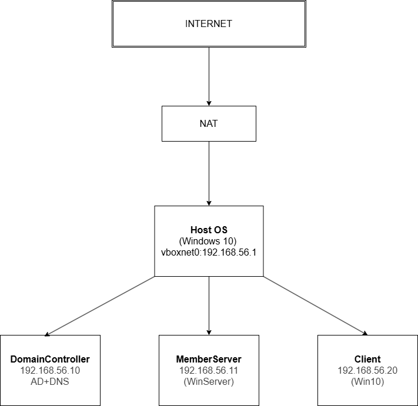
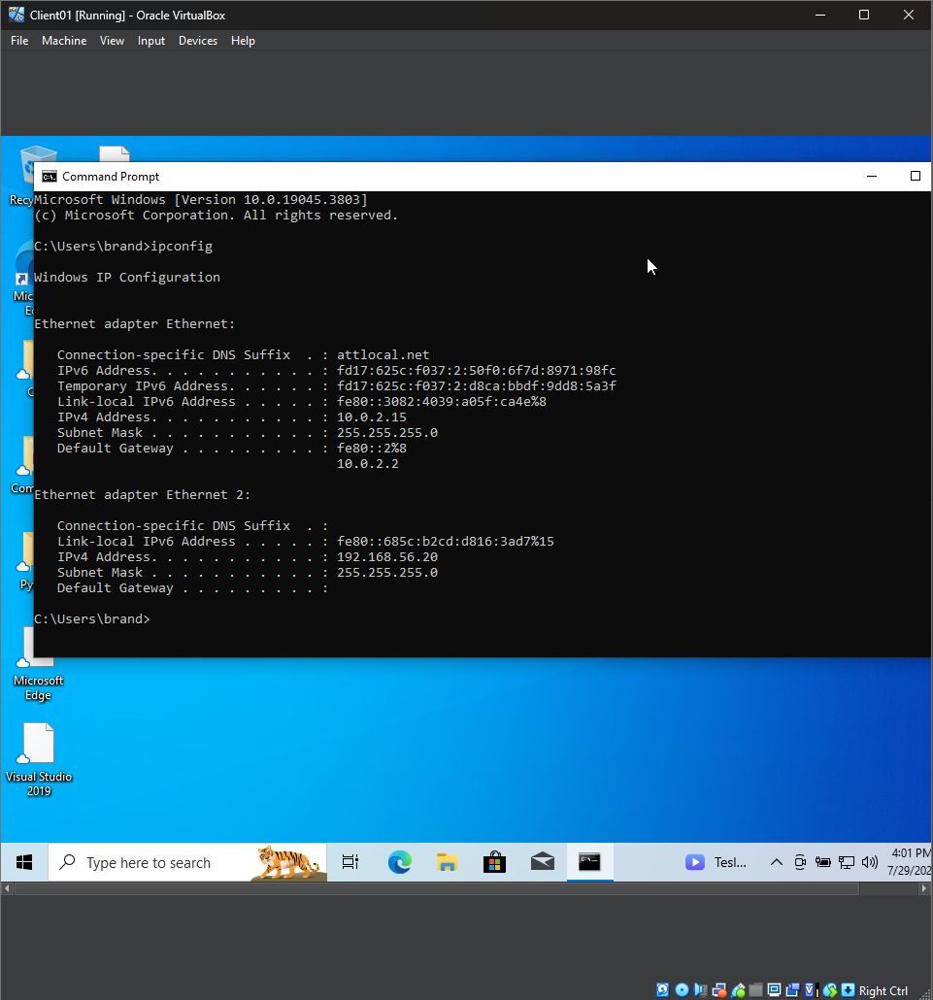
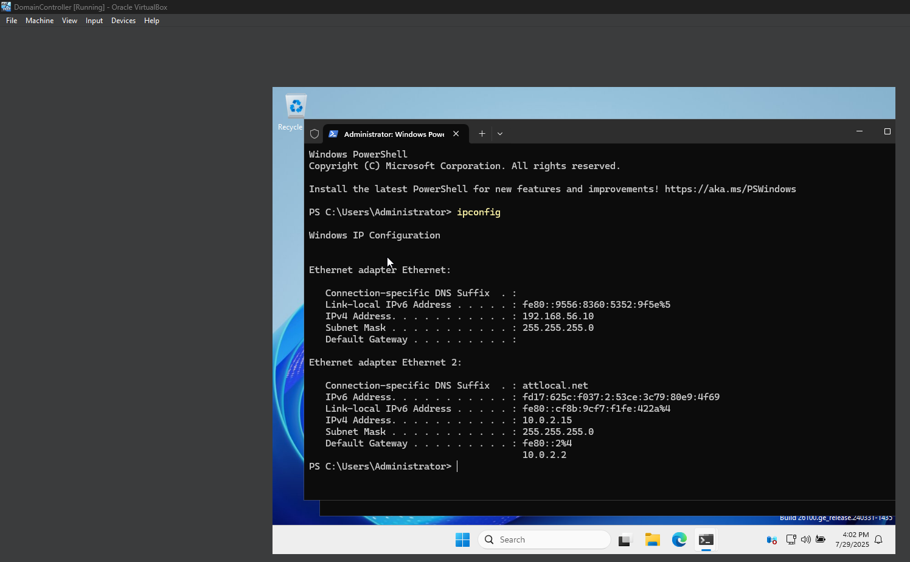
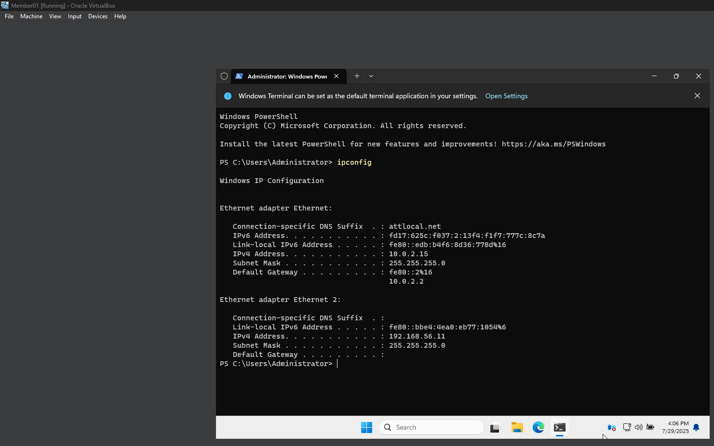
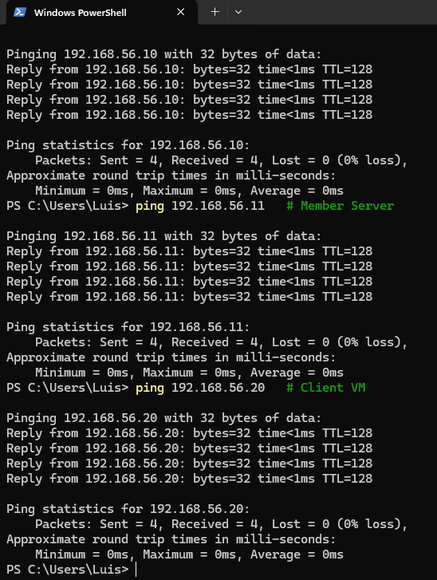

# Home Lab – Week 1 Setup

## 🖥️ Platform
- Host OS: Windows 10
- Virtualization: Oracle VirtualBox + Extension Pack

## 📥 Downloaded ISOs
Stored in: `E:\IT_Admin_Project\Virtual_Machines`

| OS              | Source URL                                                   | Filename         |
|-----------------|--------------------------------------------------------------|------------------|
| Windows Server 2022 | https://www.microsoft.com/evalcenter                        | WinServer2022.iso |
| Windows 10 Pro      | https://www.microsoft.com/software-download/windows10      | Win10.iso         |

## 🌐 Network Configuration

We use two networks per VM:

- **Adapter 1 (NAT)** – for Internet access
- **Adapter 2 (Host-Only Adapter)** – for private LAN between VMs

## 🗺️ Topology Diagram

The diagram below shows the layout of the home lab environment, including:

- Host machine
- VirtualBox Host-Only Adapter (`vboxnet0`)
- Each VM (Domain Controller, Member Server, Client)
- IP addresses
- Network roles (NAT + Host-Only)
- Services (AD, DNS)



### Host-Only Adapter Info:
- Name: `VirtualBox Host-Only Ethernet Adapter`
- IP: `192.168.56.1`
- Subnet: `255.255.255.0`
- DHCP: (Enabled/Disabled, based on your config)

### Assigned Static IPs (Host-Only):
| VM Role         | Hostname   | IP Address       | DNS               |
|------------------|------------|------------------|-------------------|
| Domain Controller| DC-2022    | 192.168.56.10    | 192.168.56.10     |
| Member Server    | Member-01  | 192.168.56.11    | 192.168.56.10     |
| Client VM        | Client-01  | 192.168.56.20    | 192.168.56.10     |





## 🏗️ VM Configuration

| VM Role          | CPU | RAM | Disk  | OS ISO            |
|------------------|-----|-----|-------|--------------------|
| Domain Controller| 2   | 4GB | 60 GB | WinServer2022.iso  |
| Member Server    | 2   | 4GB | 60 GB | WinServer2022.iso  |
| Client VM        | 2   | 2GB | 40 GB | Win10.iso          |

Each VM has:
- Adapter 1 (NAT)
- Adapter 2 (Host-Only - `vboxnet0`)

## 👑 Promoted Domain Controller

For the Domain Controller:
- Added role: **Active Directory Domain Services**
- Promoted to domain controller
- Created new forest: `lab.local`

## 🔁 Connectivity Tests

From Host Windows Terminal:

```bash
ping 192.168.56.10  # DC
ping 192.168.56.11  # Member Server
ping 192.168.56.20  # Client VM
```



