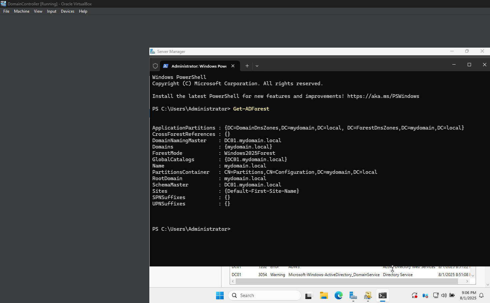
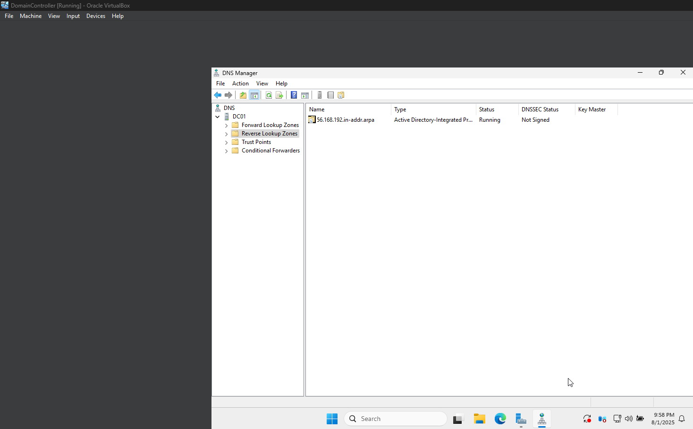
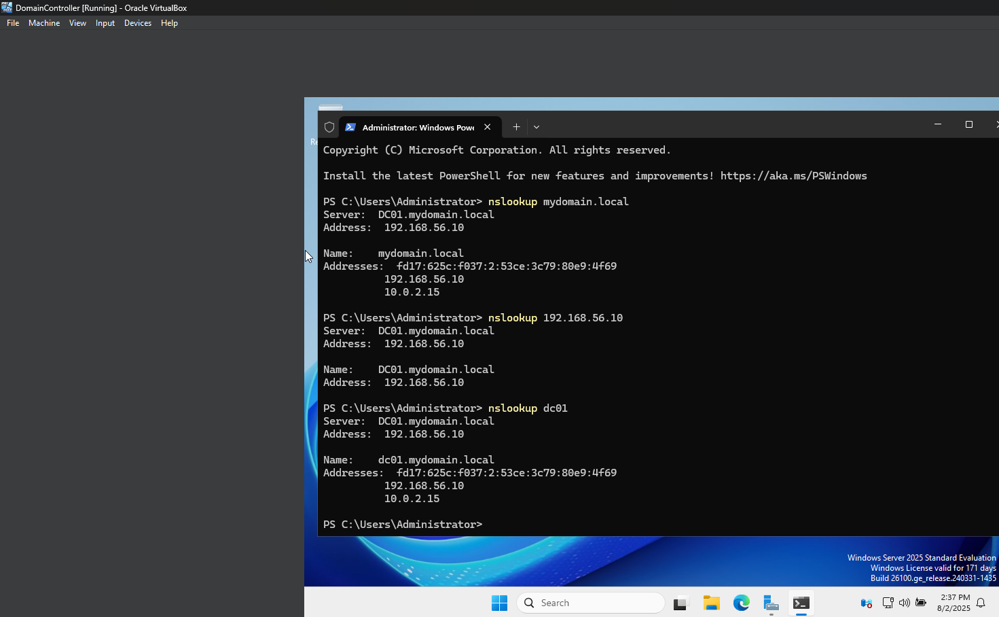
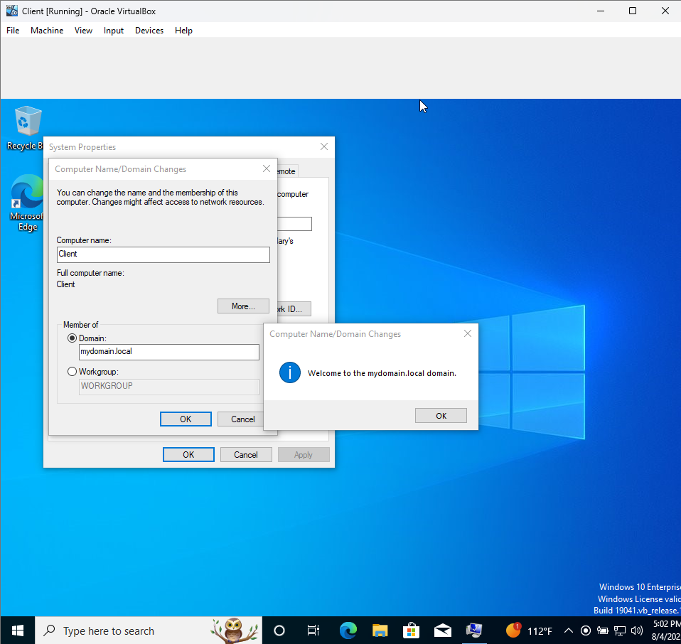
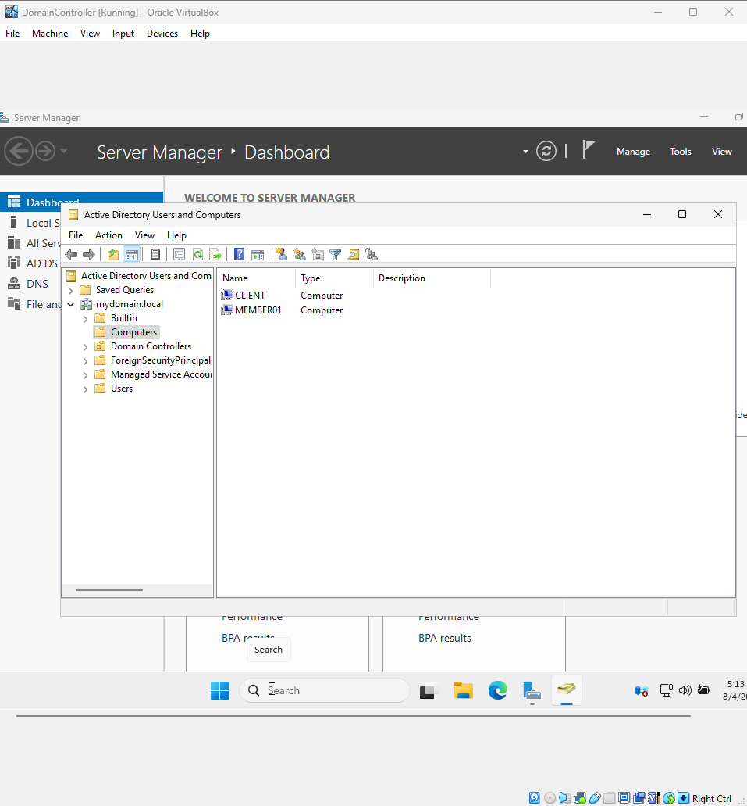
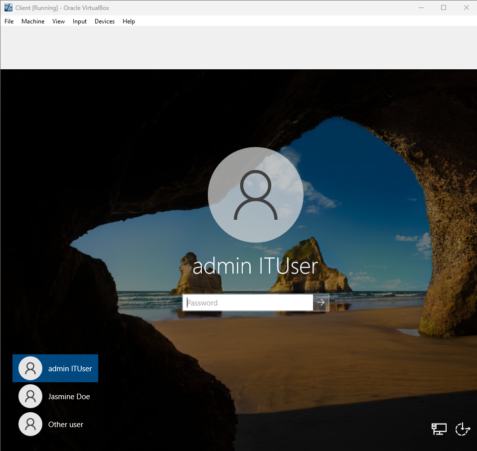
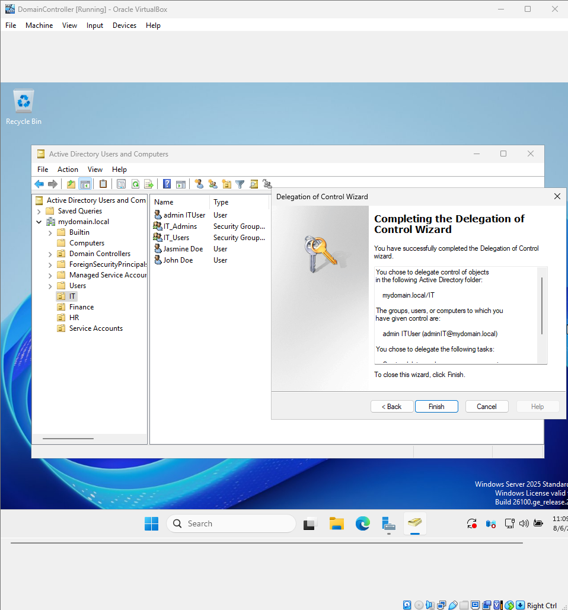
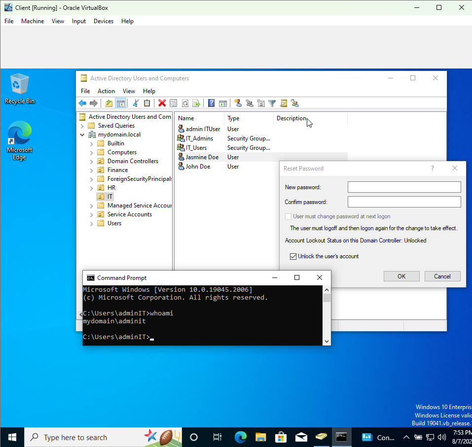

# Week 2 Lab: Active Directory & DNS Setup

## Overview
This lab covers setting up a Windows Server Domain Controller with Active Directory Domain Services (AD DS) and DNS, configuring member servers and clients, and managing organizational units (OUs), users, groups, and delegation.

---

## ✅ Completed Steps

### 1. Verify AD DS & DNS Installation

- Opened **Server Manager** on the Domain Controller (DC).
- Verified presence of **Active Directory Users and Computers** and **DNS** tools.
- Confirmed domain (e.g., `mydomain.local`) exists.
- Verified Forward and Reverse Lookup Zones in DNS Manager.

<!-- Insert screenshot: Server Manager showing ADUC and DNS -->


---

### 2. DNS Zones Setup

- Confirmed Forward Lookup Zone for domain `mydomain.local`.
- Created Reverse Lookup Zone for network `192.168.56.0/24`:
  - Zone Type: Primary Zone
  - Network ID: `192.168.56`
  - Enabled secure dynamic updates.
- Created PTR record:
  - IP: `192.168.56.10`
  - Hostname: `DC01.mydomain.local`

<!-- Insert screenshot: DNS Manager showing forward and reverse zones -->


---

### 3. Test Name Resolution on DC

Ran the following commands on the Domain Controller to test DNS resolution:

```powershell
nslookup DC01
nslookup DC01.mydomain.local
ping DC01
ping DC01.mydomain.local 
```



### 🖥️ 4. Join Member Server & Client to the Domain

On each of the other VMs:

1. **Set Preferred DNS to the DC:**

- Go to Network Settings → IPv4
- Use these settings:
    - **IP Address:** 192.168.56.11 or 192.168.56.20  
    - **Subnet Mask:** 255.255.255.0  
    - **Default Gateway:** 192.168.56.10 (optional)  
    - **DNS Server:** 192.168.56.10 ← *very important*

2. **Join Domain:**

- Open System Properties:
- Press `Win + R` → type `sysdm.cpl` → Enter
- Click **Change** → Select **Domain** and enter `mydomain.local`
- Enter domain credentials:  
Username: `Administrator (DC)`  
Password: `<domain password>`
- Restart when prompted

<!-- Insert screenshot: System Properties domain join dialog -->



3. **After reboot:**

- Log in using your domain credentials:  
Example: `MYDOMAIN\Administrator`

<!-- Insert screenshot: Logged in desktop of domain user on client VM -->


### 🗂️ 5. Create Organizational Units (OUs)

Back on the Domain Controller (DC):

- Open **Active Directory Users and Computers (ADUC)**.
- Right-click the domain (e.g., `mydomain.local`) → **New** → **Organizational Unit**.
- Create the following OUs:

```
    mydomain.local
    ├── IT
    ├── HR
    ├── Finance
    └── Service Accounts
```
---

### 👥 6. Add Users & Groups

In ADUC:

- Right-click an OU → **New** → **User**  
  Example users: `jsmith`, `kmendoza`, `adminuser`

- Create groups such as:  
  `IT_Admins`, `HR_Staff`, `Domain_Users`, etc.

- Assign users to groups:  
  Right-click user → **Add to Group**

- Test by logging into the Client VM with a domain user (e.g., `jsmith`).

<!-- Insert screenshot: Users and groups in ADUC -->


---

### 🧾 7. Delegate Control

Example:

- Right-click the **IT OU** → **Delegate Control**.
- Add a user (e.g., `adminIT@mydomain.local`).
- Delegate permissions like:  
  - Reset user passwords  
  - Create, delete, and manage user accounts

<!-- Insert screenshot: Delegate Control wizard -->



<!-- Insert screenshot: Logged in as delegated user on client with delegation controls -->


